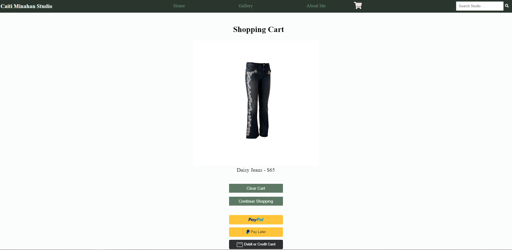

# ECommerceSite.github.io

## Final Junior Design Project 

## Design Overview

### Purpose
For this project, I tasked myself with creating a fully functional static e-commerce website hosted on GitHub Pages. The primary goal is to provide users with an intuitive and seamless shopping experience while showcasing my artwork available for purchase.

### Original Design Concepts
Initially, I considered various design concepts, focusing on user experience, responsiveness, and aesthetic appeal. The final design incorporates previews of my original, one-of-a-kind pieces via the various page layouts, responsive pages to accommodate various sized displays, and intuitive designs to make the site as welcoming and user-friendly as possible. 

Most of the implementation includes the client-side code for interacting and navigating around the site, but basic server-side code has been developed for simulating payment methods, log-in authentication, and submitting requests for custom orders. To do this, I used the Express framework for creating the server-side solution and testing it by locally hosting a server through an open port. Express.js, or simply Express, is a back end web application framework for building RESTful APIs with Node.js, released as free and open-source software under the MIT License. It is designed for building web applications and APIs. It has been called the de facto standard server framework for Node.js 

### Project Justification
The 6-week timeline was justified based on the complexity of implementing custom HTML, CSS and JavaScript, in addition to registering for a domain, ensuring secure encryption handling through HTTPS protocols, and setting up basic back-end code for the server-side solution. 

The motivation for this project is my desire to pursue my passion for art making and further develop my career as an artist after I graduate. I have been making art since I was young, and starting in 2022, I was hired as a student artist at the University Store on Fifth Avenue. While I enjoy being part of the group of student artists at the art den, I wish to advance my skills as a computer engineer by gaining experience in web development while simultaneously focusing on becoming an independent small-business owner. 

## Preliminary Design Verification

### Testing Results
Preliminary testing involved creating all client-side code for the page layouts, deploying the site and ensuring it can be accessed from the published link on GitHub Pages, and verifying basic page functionality according to the custom JavaScript I wrote. Results from these tests confirmed the feasibility of the design, ensuring compatibility with different displays and browsers. This proved my client-side code was implemented correctly as I was able to interact with the site as I normally would with any other website. 

Before finalizing any page styling, basic CSS was generated to display basic page frameworks that I would later modify to style the make with a sleek, professional design. Below are images of what my pages looked like originally versus the final product:

#### Initial Page Layout: 

#### Final Page Layout: 

As you can see, a lot of work has been done to create the site I am proud of today!

Additionally, testing was done to verify the server-side implementation by following the Express framework for starting the local server and running "server.js" from the terminal to test the following dynamic features of the site: payment gateway, log-in authentication and submitting customization requests. Upon this testing, it was discovered that these dynamic features can be simulated through local hosting, however, a Virtual Private Server needs to eventually be implemented to have these features be fully operational. This item has been added to the backlog of the project to keep subscription costs to a VPS at a minimum. 

### Test Plan
The test plan included launching the site from the link published by GitHub Pages, ensuring responsiveness by opening the site on different sized screen/monitors, navigating through the site pages to trigger events, and running "server.js" from the terminal for the server-side code. 

## Design Implementation

### System Overview and Subcomponents
The final design includes an e-commerce site found at this link: https://caitiminahan.github.io/ECommerceSite.github.io/. When first visiting the link, users will be greeted with the landing page, where they can view the items available for sale by clicking the "View Studio" button, or they can visit other pages using the navigation links in the header, or by simply go directly to what they are looking for using the search bar. Below is a breakdown of all relevant files in the project and which pages they correspond to: 
1. index.html - This is the initial landing page that users see when they first visit the site. This file is located in the top level directory, and is the code GitHub Pages looks for when tying the custom domain name to the page that should be displayed. From this page, users can see a carousel which rotates through a handful of images previewing my artwork. To leave this page, use the "View Studio" button, any of the navigation links in the header, or the search bar. Relevant areas are highlighted below: 
    

2. shop.html - This is the shopping area users are directed to after clicking the "View Studio" button from the landing page. From this page, users can view which items are available, navigate to the individual products they are interested in by hovering over the item and clicking, "View Products", or navigate to other pages via the header links or search bar. The "Caiti Minahan Studio" link in the header will direct users back to the landing page, and the other header links will direct users to their own pages as well. A preview of this page is shown below: 
    

3. artwork1.html-artwork8.html - These are the product details pages for each product. From this page, users can view larger images of the piece, add to cart if they wish, add customization requests, and read further details via the drop-down menus regarding the item details, shipping and returns, and artist details. From this page, users can use the header links to either view the item in their cart, or can continue shopping by visiting another page: 
    
    

4. checkout.html - This is the shopping cart page. Users can view their items before proceeding to checkout, continue shopping, or remove all items from their cart. Payment methods are implementing using the PayPal Developer Standard Checkout method. This involved implementing both client-side code to add the widgets on the page as well as testing it with the server-side code. A preview of the shopping cart and payment method is shown below: 
    
    
    If users wish to pay using their credit/debit card instead, they can do so: 
    
    After clearing items from the cart using the "Clear Cart" button, the screen will look like this: 

    And users can be directed back to the shopping area by either clicking "Home" or "Continue Shopping"

5. about_us.html - This is the page providing background about myself discussing the motivation behind my pieces, what I specialize in, and contact information through my social media. A preview of this page is shown below: 
    

6. gallery.html - This is a page for displaying preview of everything available in the shop. The purpose of this page is to simply showcase the art, without the additional sections from the home page. An image of the gallery page is shown below: 
    

The system is built using custom HTML, CSS, and JavaScript to achieve a seamless and responsive e-commerce platform.

### Design Process
The design process involved creating basic templates for each page, iterating through various design styles, testing multiple variations of JavaScript to respond to events, and a lot of YouTube tutorials. Using a JetBrains IDE (i.e., WebStorm) to connect my GitHub for version control was essential. Through the various iterations of my website's design, there were occasions where the main branch needed to be reverted back to a previous commit. Without version control, I would not have been able to save myself (many times) from accidentally breaking my code. 

Some challenges I faced were making the site pages configurable to different sized screens. I aimed to create a site that auto-adjusts depending on the display resolution/size so the site can look consistent throughout for all users. This was done by adding media queries in JavaScript. Media queries are one of the key ingredients for responsive web design. They are used to determine the width and height of the viewport to make web pages look good on all devices (i.e., laptops, desktops, tablets, etc.)

Other challenges were learning HTML, CSS and JavaScript for the first time in this short 6-week period. Though there was a learning curve in the beginning, the payoff is very rewarding as this is a skill I have been wanting to learn and plan to continue learning after this project concludes. 

## Design Testing

### Test Results
The final prototype underwent many iterations of manual/visual testing, which consisted of repeatedly deploying the site, triggering events through mouse clicks for the client-side code, and running the server.js for locally testing the server-side solution. 

To deploy the client side code, the script for each HTML page can be ran directly from the IDE and hosted locally to be viewed in a browser. A preview of how to do that from the IDE is as follows: 

And then the script is ran to host the site locally and have the page displayed in a browsers like this: 

Additionally, the server-side code can be tested by running commands in the terminal. This can either be done in a Command Prompt, or directly in the IDE's terminal. 

To test the server-side code implementing the payment gateway, simply run "npm start"

This will cause the local server to run at an available port, which is set to port 63342. The server is known to be running locally when the terminal displays, "Node server listening at". By clicking the link it posts, you will be lead to the web page which implements the dynamic behavior. So in this case, that link would take you to the shopping cart page, since the payment gateway requires the server-side solution. From there, users can complete payment methods as long as the local server is running. 

The reason a local server is required for the payment method is because without the server-side code, there is no way to process payments. Static sites are great for features that do not require secure encryption or references to a database. That's why my site is mostly static, however, there are some features, such as the payment gateway which require the server-side solution in order function as a proper e-commerce site.

### Debugging Process
When it came to debugging the client-side code, that was a matter of trial and error. When iterating through various designs of the web pages, I would make a small change to the HTML and CSS and then refresh the page to see what, if anything changed. This was a painful process at times, but through trial and error, I discovered what styling techniques I liked for my site, and I was able to land on the final design I have now.

For debugging the server-side code, this involved running the server.js (part of the server-side code) and following the detailed debugging logs found in the console. For example, when troubleshooting the payment gateway, I ran into some issues with some lines were written in the dependencies file (package.json). Since the error messages were quite descriptive, I was able to locate the exact lines which needed fixed. An image of the console messages are below: 

## Summary, Conclusions, and Future Work

### Project Summary
In conclusion, this project successfully delivered a static e-commerce website with dynamic features for the payment gateway, secure encryption protocols using HTTPS and custom HTML, CSS and JavaScript for my desired styling and functionality.

### Conclusions
Key learnings from this assignment include the importance of learning the difference between static and dynamic website development, when either type is preferred, and how to implement a mix of both to suit my needs for an e-commerce website. 
Since there are ample resources available online to learn about website development, I would recommend following YouTube tutorials from different people and taking bits and pieces from each to incorporate into your own design. 

Additionally, I highly recommend following a framework when developing a website because it allows you to build off of well-structured templates and modify it according to the site's specific needs. 
In my case, following the express.js framework was useful for implementing the payment processing because it allowed me to integrate PayPal's third-party API to create a payment gateway after checking out. Express is well-suited for building RESTful APIs, which allows for a clean separation between the frontend and backend code of the website. 

### Future Work
Concluding this project submission, I plan to continue developing the server-side code for my website. I have a few items in my backlog for dynamic features that I wish to eventually implement, such as creating a full-functional method for submitting customization requests for orders, and creating login/signup pages for users who wish to create an account.

The final step of implementing my own e-commerce site will be to purchase a Virtual Private Server (VPS) for continuously running a server to allow my site to be accessed by users at any time and purchase their artwork at their convenience. 
